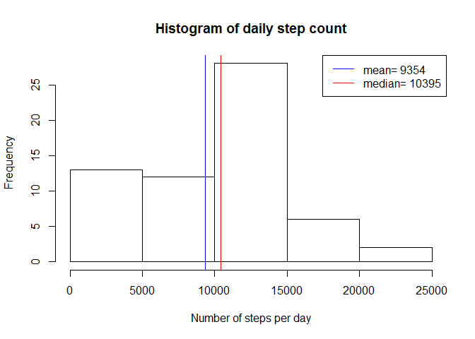
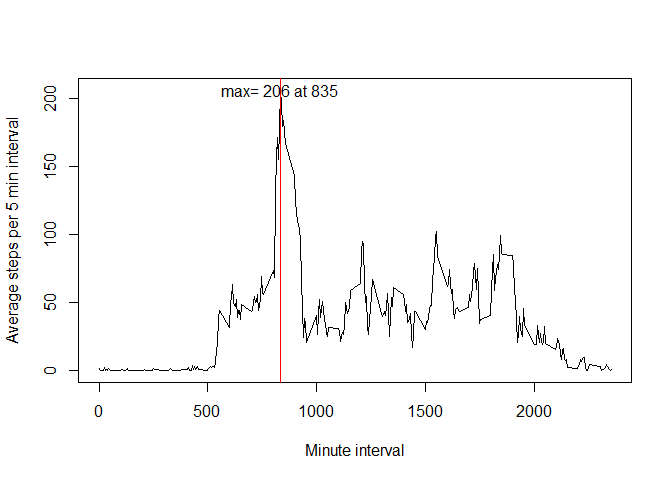
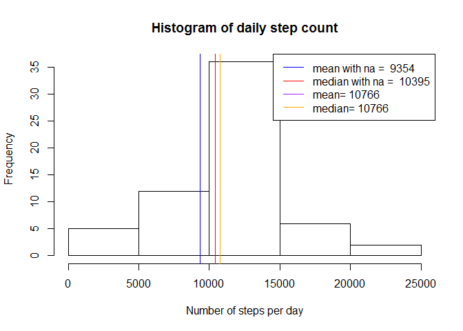
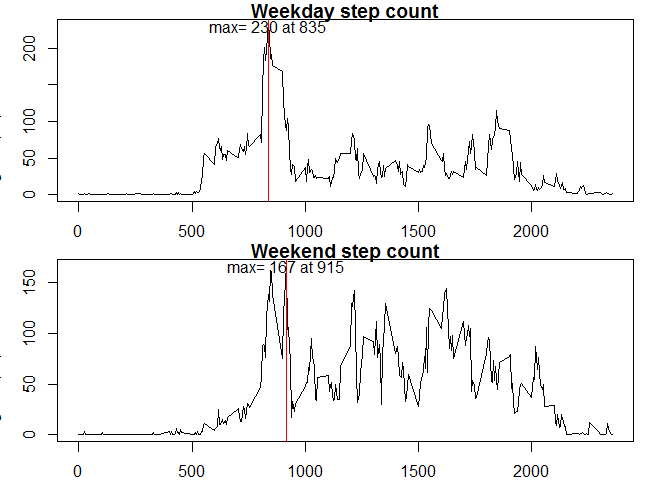

## Loading and preprocessing the data  
The following code will unzip and load the activity.csv file containing our data.

```r
activity <- read.csv(unz("activity.zip", "activity.csv"))
```

## What is mean total number of steps taken per day?  
The total number of steps taken per day can be calculated by taking the sum of all steps in each interval for each day separately. The code below will also calculate the mean and median, and provide a histogram of the step count. The mean and median are indicated in the plot as well. 

```r
daysum <- with(activity, tapply(steps, date, sum, na.rm=T))
daymean <- mean(daysum) ## Note that currently NA's are 0's, dropping the average
daymedian <- median(daysum)
hist(daysum, xlab="Number of steps per day", main="Histogram of daily step count")
abline(v=daymean, col="blue")
abline(v=daymedian, col="red")
legend("topright", legend=c(paste("mean=", round(daymean)), paste("median=", daymedian)), lty=1, col=c("blue", "red"))
```

<!-- -->
  
*The mean is 9354, and the median 10395*.
  
## What is the average daily activity pattern?  
The following code will calculate the average number of steps taken during each 5 minute time interval and plot the result.

```r
day5minmean <- with(activity, tapply(steps, interval, mean, na.rm=T))
max5min <- max(day5minmean)
maxind <- which(day5minmean == max5min)
plot(as.numeric(names(day5minmean)), day5minmean, type="l", xlab="Minute interval", ylab="Average steps per 5 min interval")
abline(v=as.numeric(names(maxind)), col="red")
text(x=as.numeric(names(maxind)), y=max5min, paste("max=", round(max5min), "at", names(maxind)))
```

<!-- -->
  
*The maximum number of steps (206) occurs in interval 835 - 840*
  

## Imputing missing values  
In the next code chunk, the NA values (in the steps) will be replaced with the average step count for the corresponding interval as calculated in the previous code section. 

```r
nr_of_na <- sum(is.na(activity))
```
*The original activity data contains 2304 NA values*.  
The corrected activity data will be stored in a variable named activity2. A histogram will show the distribution of the daily step count, and calculate the mean and median. For reference also the mean and median of the uncorrected data is shown.

```r
activity2 <- activity
actisna <- is.na(activity)
nrdays <- length(unique(activity$date))
activity2[actisna] <- rep(day5minmean, nrdays)[actisna]
daysum2 <- with(activity2, tapply(steps, date, sum, na.rm=T))
daymean2 <- mean(daysum2)
daymedian2 <- median(daysum2)
hist(daysum2, xlab="Number of steps per day", main="Histogram of daily step count")
abline(v=daymean, col="blue")
abline(v=daymedian, col="red")
abline(v=daymean2, col="purple")
abline(v=daymedian2, col="orange")
legend("topright", legend=c(paste("mean with na = ", round(daymean)), paste("median with na = ", daymedian), paste("mean=", round(daymean2)), paste("median=", round(daymedian2))), lty=1, col=c("blue", "red", "purple", "orange"))
```

<!-- -->

  
*The mean 10766 is now higher than the original mean (9354). Also the median 10766 is higher than the original median (10395). This can be expected, as the NA's are now replaced with values higher than zero.*  

## Are there differences in activity patterns between weekdays and weekends?
We will examine how activity patterns in weekdays and weekends differ by marking the data with a factor indicating whether the data is from a weekday or weekend, and provide two plots showing a plot of the average number of steps by time interval. The maximum is indicated in the plot.

```r
activitywd <- weekdays(as.Date(as.character(activity2$date)))
activity2$day <- factor(activitywd == "lauantai" | activitywd == "sunnuntai", labels = c("weekday", "weekend"))
day5minmean2 <- with(activity2, tapply(steps, list(interval, day), mean, na.rm=T))
par(mfrow=c(2, 1), mar=c(2, 3, 1, 2))
plot(as.numeric(rownames(day5minmean2)), day5minmean2[,"weekday"], type="l", xlab="Minute interval", ylab="Average steps per 5 min interval", main="Weekday step count")
max5min_wd <- max(day5minmean2[,"weekday"])
max5min_we <- max(day5minmean2[,"weekend"])
maxind_wd <- which(day5minmean2[,"weekday"] == max5min_wd)
maxind_we <- which(day5minmean2[,"weekend"] == max5min_we)
abline(v=as.numeric(names(maxind_wd)), col="red")
text(x=as.numeric(names(maxind_wd)), y=max5min_wd, paste("max=", round(max5min_wd), "at", names(maxind_wd)))
plot(as.numeric(rownames(day5minmean2)), day5minmean2[,"weekend"], type="l", xlab="Minute interval", ylab="Average steps per 5 min interval", main="Weekend step count")
abline(v=as.numeric(names(maxind_we)), col="red")
text(x=as.numeric(names(maxind_we)), y=max5min_we, paste("max=", round(max5min_we), "at", names(maxind_we)))
```

<!-- -->
  
  
*Note: my locale is Finnish, so weekend days are: lauantai = saturday, and sunnuntai = sunday.*
